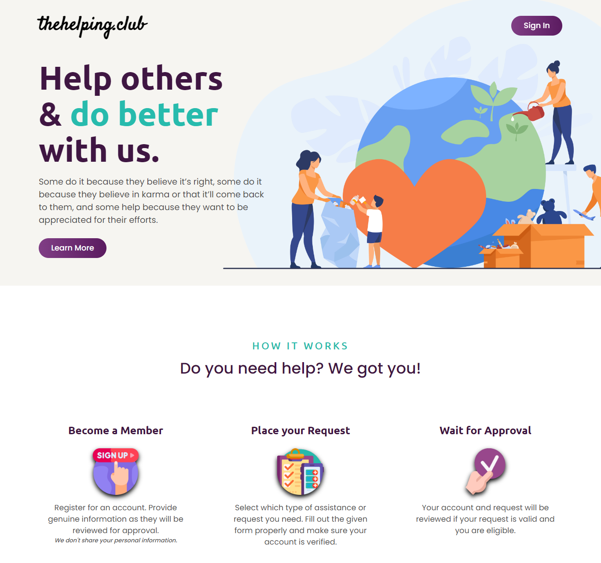

# The Helping Club



## 💡 Inspiration 💡

The goal or aim of this app is to help unfortunate people who are less financially equipped like most elders where I'm from. When the pandemic hit, we were required to stay home for months, most people lost their jobs and other businesses were not allowed to operate.

Staying at home with no source of income is really hard. I made this app to somehow help others for their basic needs like medicine that could be provided by the government or food thru donations.

## ⚙ What it does ⚙

It allows people, ideally, resident of a certain town that the app will be used, and they can ask for assistance, e.g. medicine, food, financial, and other basic needs. They will place a request and will need to provide all required documents such as prescriptions and identification (government-issued) and the people in charge will check the database monitored by government to verify if the documents are genuine.

## 🏗 How we built it 🏗

Plan, execute and miscalculate :)

## Installation

1. Clone the repository.

```
git clone https://github.com/rvitality/neighborhood-hacks.git
```

2. Install the dependencies

```
npm install
```

3. Run the server. Do note that the server runs on port 5173.

```
npm start
```
